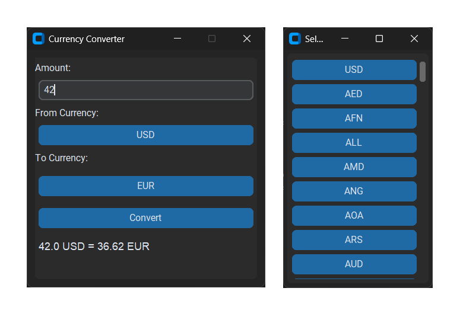

# Currency Converter

A small desktop currency converter built with Python and CustomTkinter.

The application uses an exchange rate API, allows users to select source and target currencies, and provides a simple bilingual interface with English and Russian language switching.

## Screenshot



## Tech Stack

- Python
- CustomTkinter
- Requests
- python-dotenv

## Setup

Clone the repository:

```bash
git clone https://github.com/machinatororis/currency_converter.git
cd currency_converter
```

Install dependencies:

```bash
pip install -r requirements.txt
```

Create a `.env` file based on `.env.example`:

```env
API_KEY=your_api_key_here
```

Run the application:

```bash
python main.py
```